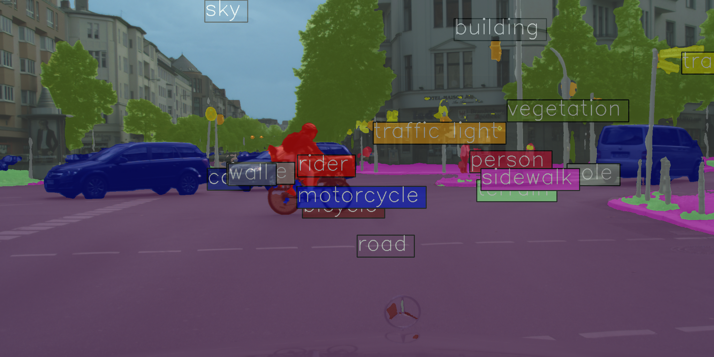
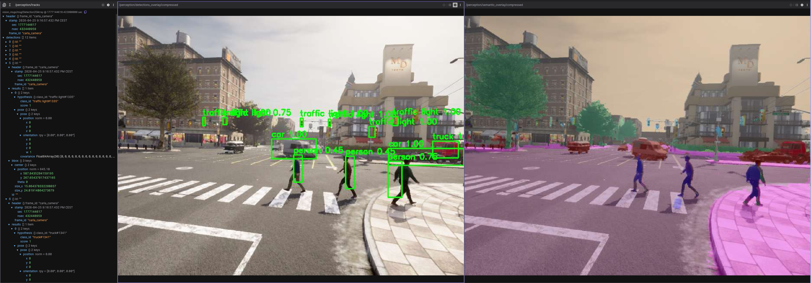

# Vision-Based Perception and Local Mapping for Autonomous Driving

A modular autonomous-driving prototype that connects semantic segmentation, object tracking, monocular depth, free-space estimation, navigation, and local mapping in CARLA and ROS2.

The project demonstrates the progression from model experimentation to a live robotics pipeline: simulator images become structured perception outputs, navigation cues, local occupancy grids, and short-term accumulated maps.

<p align="center">
  
</p>

## Current Stack

```text
CARLA RGB + hero odometry
        |
        +--> semantic segmentation --> object extraction --> tracking --+
        |                                                               |
        +--> monocular depth --------------------------------------------+--> object-depth fusion
        |
        +--> segmentation + depth --> free-space estimation --> reactive navigation
        |
        +--> segmentation + depth --> local occupancy layers
                                             |
hero odometry + local occupancy layers ------+--> accumulated local mapping
```

The accumulated mapping stage maintains recent occupancy evidence in world coordinates and publishes combined, static, and dynamic map layers. It uses CARLA odometry as an intermediate step toward future ego-motion estimation and SLAM-like mapping.

## Highlights

- SegFormer semantic segmentation trained and refined with Cityscapes and CARLA data.
- CARLA dataset collection, Cityscapes-19 conversion, filtering, and targeted rare-class sampling.
- ROS2 nodes for segmentation, object extraction, tracking, monocular depth, and object-depth fusion.
- Semantic-depth free-space estimation and two reactive navigation prototypes.
- Local occupancy grids with separate static and dynamic obstacle layers.
- Short-term accumulated local mapping using simulator-provided odometry.
- Compressed visualization outputs for live inspection.

## Architecture

The repository is organized into four layers:

| Layer | Scope |
| --- | --- |
| Model development | MMSegmentation configs, training, evaluation, inference, and qualitative overlays |
| Dataset engineering | CARLA collection, label conversion, filtering, pruning, and dataset balancing |
| ROS2 perception | Image bridging, segmentation, detection, tracking, depth, and fusion |
| Navigation and mapping | Free-space control, local occupancy estimation, and accumulated local maps |

The ROS2 workspace includes these principal nodes:

```text
carla_bridge_node           semantic_seg_node
object_detection_node      tracking_node
depth_node                 fusion_node
free_space_node            reactive_navigation_node
free_space_navigation_node local_occupancy_node
local_mapping_node         carla_control_node
```

## Example Outputs

### Semantic Segmentation



### Object Extraction and Tracking



### Local Occupancy and Mapping

<p align="center">
  
</p>

## Repository Layout

```text
configs/       MMSegmentation training and fine-tuning configurations
scripts/       Training, evaluation, inference, and visualization utilities
carla_tools/   Simulator data collection and dataset preparation tools
ros/ros2_ws/   ROS2 perception, navigation, and mapping workspace
docs/          Setup, operation, timeline, and milestone documentation
assets/        Portfolio images and demonstrations
```

## Getting Started

The project provides a pinned Conda environment and pip dependency set:

```bash
conda env create -f environment.yml
conda activate ros2seg
```

For the available setup notes, ROS2 workflow, and technical milestone records, start with the [documentation index](docs/README.md).

## Project Status

Implemented work currently reaches accumulated local mapping:

```text
segmentation
  -> tracking and depth fusion
  -> semantic-depth free space
  -> reactive navigation
  -> local occupancy layers
  -> accumulated local mapping
```

The map is a short-term local representation based on simulator odometry, not a complete SLAM system. Current research directions include improved ground projection, timestamp-aware fusion, rolling maps, visual odometry, and map-based navigation.

## Technical Stack

Python, PyTorch, MMSegmentation, MMEngine, SegFormer, Depth Anything V2, ROS2, CARLA, OpenCV, NumPy, `cv_bridge`, and `vision_msgs`.

## License

Licensed under the MIT License. See [LICENSE](LICENSE).
