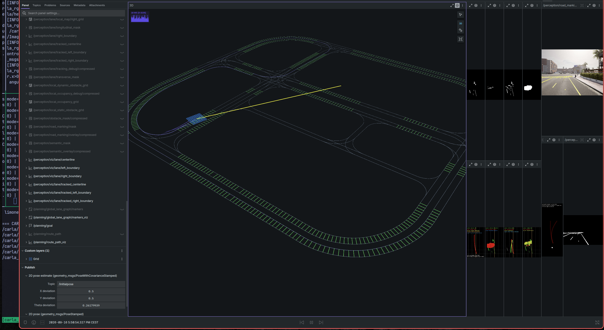
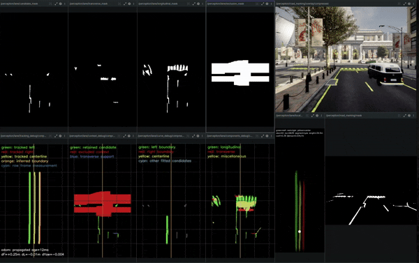
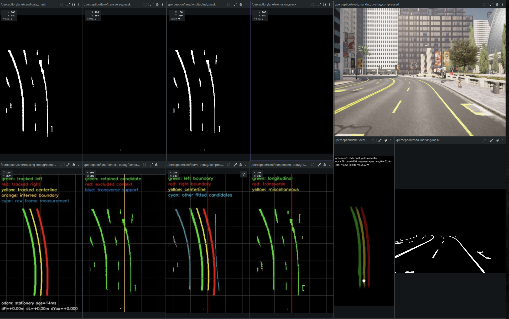
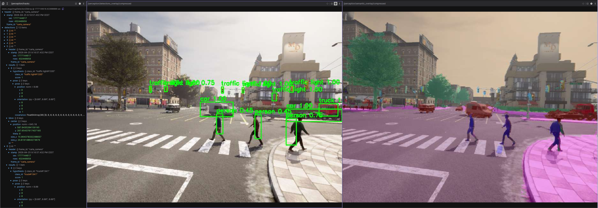

# Vision-Based Perception, Lane Mapping, and Global Routing

A modular educational autonomous-driving prototype in CARLA + ROS2. The goal is to understand and implement a coherent autonomy stack with explicit subsystem interfaces and deliberately simple algorithms.

The current focus is a perception-derived local LaneMap and an OpenDRIVE-derived global RoutePlan. Associating these two representations is the next integration milestone.

<p align="center">
  
</p>

**Global routing:** OpenDRIVE-derived routing graph, ego pose, and selected RoutePlan live in Foxglove. This visualization demonstrates routing, not closed-loop autonomous driving.

## Current Stack

```text
CARLA RGB + camera calibration                 CARLA / OpenDRIVE
        |                                            |
road-marking segmentation                     directed topology
        |                                            |
BEV lane geometry + filtering                 sampled routing graph
        |                                            |
temporal tracking + hero odometry             ego + goal association -> A*
        |                                            |
rolling local LaneMap                         global RoutePlan
        |                                            |
        +--------> RoutePlan ↔ LaneMap association <--+
                   [NEXT; NOT IMPLEMENTED]
                              |
                   behavior/maneuver planning [FUTURE]
                              |
                   local trajectory planning [FUTURE]
                              |
                   trajectory tracking/control [FUTURE]
```

LaneMap and RoutePlan publish world geometry in direct `carla_world`, but own separate geometry, identifier, and revision semantics. Global routing does not consume LaneMap yet. Uncertain or missing perception is not replaced with simulator-map geometry.

## Project Status

**Current milestones — implemented as of 2026-09-16:**

- ✓ Lane-specific road-marking segmentation and metric BEV lane geometry.
- ✓ Geometric/context filtering, curve fitting, temporal lane tracking, and odometry propagation.
- ✓ Rolling vector `LaneMap` with sampled boundaries, centerline, curvature, and confidence.
- ✓ CARLA/OpenDRIVE topology extraction and a sampled directed routing graph.
- ✓ Dijkstra baseline, A* production search, and ego/goal graph association.
- ✓ Valid/invalid `RoutePlan` publication.
- ✓ Planning/Foxglove visualization and reproducible startup tooling.

Development runtime validation is recorded in the [lane perception, tracking, and mapping milestone](docs/milestones/lane_perception_tracking_mapping.md) and [global route planning milestone](docs/milestones/global_route_planning.md).

**NEXT:** RoutePlan ↔ LaneMap association. `feature/route-lane-association` starts from the completed routing/startup checkpoint; association is not implemented.

**FUTURE:** behavior/maneuver planning, local trajectory planning, and trajectory tracking/control. The global coarse route is nominal map geometry, not a dynamically feasible control trajectory. Existing reactive controllers do not complete this pipeline.

See the [current state](docs/agent/CURRENT_STATE.md) and [small dependency-aware roadmap](docs/agent/ROADMAP.md).

## Current Lane Perception and Mapping

<p align="center">
  
</p>

**Lane tracking in motion:** the temporal lane-processing pipeline follows lane geometry over time.

<p align="center">
  
</p>

**Diagnostic view:** road-marking candidates, geometric/context filtering, curve fitting, and temporal tracking alongside camera context. This pipeline feeds the rolling perception-derived LaneMap; the view does not display every LaneMap field.

## Current Architecture

The current critical path preserves explicit ROS2 interfaces between local lane perception and global routing:

| Layer | Responsibility |
| --- | --- |
| CARLA interface | RGB, CameraInfo, and hero odometry |
| Lane perception | Road-marking segmentation, metric BEV geometry, filtering, and curve fitting |
| Temporal lane reasoning | Tracking, ego-motion propagation, lane width, and confidence |
| Local environment representation | Rolling perception-derived vector LaneMap |
| Global route planning | OpenDRIVE topology, sampled directed graph, ego/goal graph association, A*, and RoutePlan |
| Visualization / operations | Planning visualization, Foxglove frames, and startup tooling |
| Next integration | RoutePlan ↔ LaneMap association **[NEXT; not implemented]** |

Current critical-path ROS2 packages:

```text
autonomy_interfaces
carla_bridge_node
road_marking_seg_node
lane_geometry_node
lane_reasoning_nodes
global_route_planner
planning_visualization
```

Earlier semantic, depth, and spatial packages remain implemented and are summarized under [Earlier Perception and Spatial Milestones](#earlier-perception-and-spatial-milestones).

## Repository Layout

```text
ros/ros2_ws/   ROS2 workspace; src/ includes:
  autonomy_interfaces/    LaneMap, RoutePlan, and future trajectory schemas
  carla_bridge_node/      CARLA image and camera calibration interface
  road_marking_seg_node/  Lane-specific road-marking segmentation
  lane_geometry_node/     BEV geometry, filtering, curve fitting, tracking
  lane_reasoning_nodes/   Tracked lane mapping and earlier reasoning prototypes
  global_route_planner/   OpenDRIVE graph construction and route search
  planning_visualization/ Route, graph, and Foxglove frame adapters
autonomous_driving_startup/ Local tmux launchers for remote CARLA/ROS2 processes
docs/          Setup, operation, timeline, and milestone documentation
configs/       MMSegmentation training and fine-tuning configurations
scripts/       Training, evaluation, inference, and visualization utilities
carla_tools/   Simulator data collection and dataset preparation tools
assets/        Portfolio images and demonstrations
```

## Getting Started

The project provides a pinned reference `ros2seg` environment:

```bash
conda env create -f environment.yml
conda activate ros2seg
```

Current remote launchers also use `ros2depth` for the lane/planning core. Follow the [setup notes](docs/setup.md) and [runbook](docs/ros/runbook.md); the [startup package](autonomous_driving_startup/README.md) runs tmux locally and ROS/CARLA remotely. The [documentation index](docs/README.md) links to further subsystem and milestone details.

## Earlier Perception and Spatial Milestones

These implemented capabilities document the perception and spatial work preceding the current lane/routing integration focus:

- SegFormer semantic segmentation trained and refined with Cityscapes and CARLA data.
- Dataset tooling for CARLA collection, Cityscapes-19 conversion, filtering, and targeted rare-class sampling.
- ROS2 object extraction and tracking, monocular depth, and object-depth fusion.
- Semantic-depth free-space estimation and two reactive navigation prototypes.
- Local occupancy grids with separate static and dynamic obstacle layers.
- Short-term accumulated local mapping using simulator-provided odometry.

Earlier/parallel ROS2 packages:

```text
semantic_seg_node          object_detection_node
tracking_node              depth_node
fusion_node                free_space_node
reactive_navigation_node   free_space_navigation_node
local_occupancy_node       local_mapping_node
carla_control_node
```

Historical accumulated occupancy mapping is a grid-based spatial representation, distinct from the current perception-derived vector LaneMap. The [parameter tuning log](docs/experiments/parameter_tuning_log.md) records earlier navigation, occupancy, mapping, and classical lane-detection iterations.

<p align="center">
  
</p>

**Earlier perception/spatial stack:** semantic perception, monocular depth, free space, occupancy, and accumulated local mapping.

<p align="center">
  
</p>

**Semantic and object perception:** live CARLA semantic segmentation with extracted object detections and tracking outputs.

## Technical Stack

Python, PyTorch, MMSegmentation, MMEngine, SegFormer, Depth Anything V2, ROS2, CARLA, OpenCV, NumPy, `cv_bridge`, and `vision_msgs`.

## License

Licensed under the MIT License. See [LICENSE](LICENSE).
